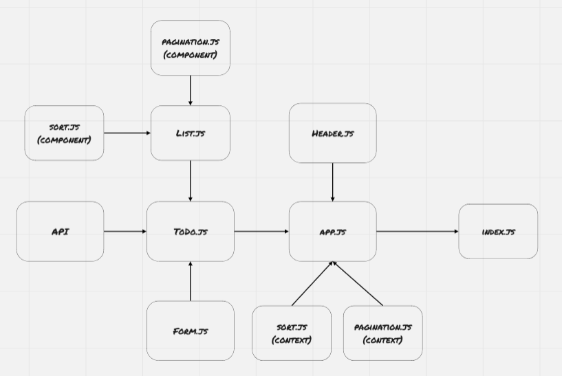

# ToDo

This app is basically to-do list manager, you can add, delete, and update items, each item can be assigned to a name, also you can determine the difficulty (from 1-5).

You can sort the list by difficulty, also you can filter them by showing only the pending items.

Before adding, deleting, or updating items, you have to login in, if you login as user you would only be able to view the list, if you login as editor, you would be able to add and update items, and finally if login as  an admin you would be able to add, update, and delete items.

* **Login as User:** username:*user*, password:*USER*.
* **Login as Editor:** username:*editor*, password:*Editor*.
* **Login as Admin:** username:*admin*, password:*ADMIN*.

### URLs

[Pull Request](https://github.com/BasharNofal/Todo/pull/5)\
[Netlify](https://bn-todo.netlify.app/)

### UML Diagram

### How do I install the app or library?

1. Clone the repo from git hub, by run the following command `git clone -repo link-`.
2. Run `npm i "dependencies names which you can find in the package.json file"`.
3. Run `npm start`.
