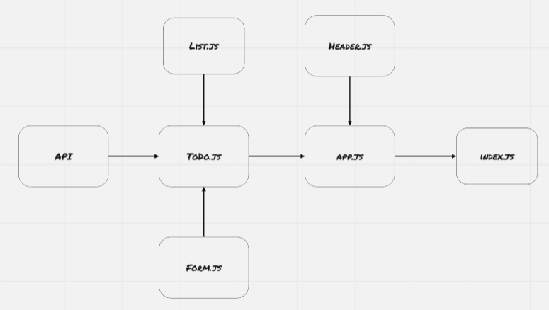

### URLs

[Pull Request](https://github.com/BasharNofal/Todo/pull/2)\
[Netlify](https://bn-todo.netlify.app/)

### UML Diagram

### How do I install the app or library?

  1. Clone the repo from git hub, by run the following command `git clone -repo link-`.
  2. Run `npm init -y`.
  3. Run `npm i "dependencies names which you can find in the package.json file"`.
  4. Run `npm start`.
